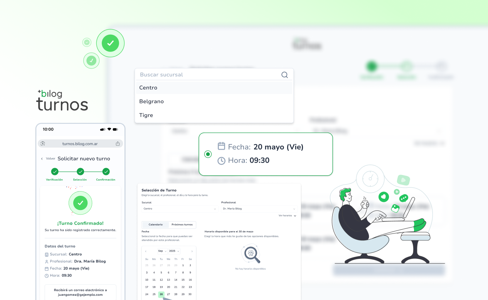

# Changelog

Todas las actualizaciones importantes de este proyecto se documentan aquí.

## [1.2.0] - 2026-01-30
### Added
- Nueva página de documentación con ejemplos de integración.
- Soporte para modo oscuro en la UI.

### Changed
- Actualizado el layout principal para mejorar la navegación.
- Refactor de componentes en `pages/changelog.tsx`.

### Fixed
- Corrección de bug en el formulario de login.
- Ajuste en estilos responsivos para móviles.

---

## [1.1.0] - 2026-01-15
### Added
- Embebido del changelog en la ruta `/changelog`.
- Configuración inicial de `openchangelog.yml`.

### Fixed
- Error en la carga de fuentes tipográficas.

## [1.3.0] - 2026-02-01 
### Added
 - Nueva funcionalidad de búsqueda en la documentación.
 - Prueba de configuraciones de archivo .yml

## [1.4.0] - 2026-03-04
### Migration
 - Migracion completada a Nextra v4

### Imagen agregada desde url externo
---

### Imagen agregada desde carpeta public
---
